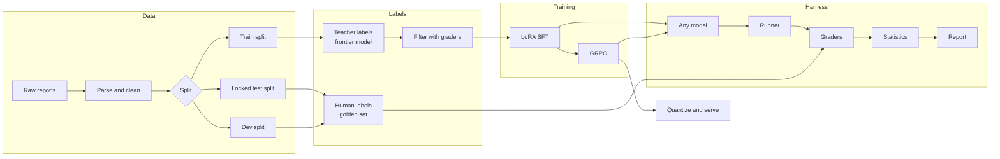
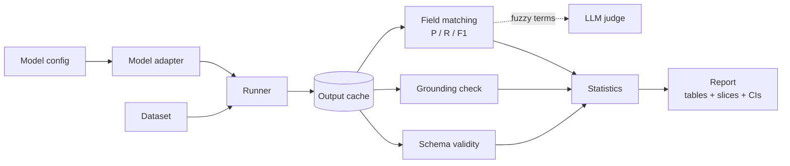

# Architecture

This document describes how Distill is put together: the components, how data flows between them, and why key design decisions were made. For a non-technical introduction, start with [OVERVIEW.md](OVERVIEW.md).

> The layout below is the target design. Individual modules land phase by phase, and details may change as the project develops.

---

## 1. System overview



There are four pieces, and the harness is the centre of the design. Every model (rule-based baseline, frontier API, base small model, each fine-tuned checkpoint) goes through exactly the same runner, graders and statistics. A result only counts if it came out of the harness.

---

## 2. Output schema

Every report maps to a list of findings.

| Field | Type | Meaning |
|---|---|---|
| `finding` | string (normalized term) | What was observed, e.g. `cardiomegaly`, `pleural effusion` |
| `status` | `present` / `absent` / `uncertain` | Handles negation ("no pneumothorax") and hedging ("cannot exclude") |
| `location` | string or null | Anatomical location, e.g. `lower lobe` |
| `laterality` | `left` / `right` / `bilateral` / null | Which side |
| `severity` | string or null | e.g. `mild`, `small`, `moderate` |
| `evidence` | string | A **verbatim** substring of the report that supports the finding |

The schema is defined once as Pydantic models and reused by the graders, the training data builder, the reward functions and the serving layer, so there is exactly one definition of what a valid output looks like.

The rules for ambiguous cases (what counts as `uncertain`, how to normalize synonyms, when a location is required) live in a written annotation guideline, so human labels are consistent and the decisions can be reviewed.

---

## 3. Data layer

- **Source:** the de-identified Indiana University chest X-ray report collection (Open-i). Data is downloaded locally and never committed.
- **Parsing:** reports are split into sections (Findings, Impression). Empty and duplicate reports are removed.
- **Splits:** train, dev and test are fixed with a seed. Near-duplicate reports are kept on the same side of the split, so templated phrasing cannot leak from train into test.
- **Locking:** the test split and its labels are fingerprinted with a content hash. The harness refuses to report test numbers if the hash does not match, which prevents quiet edits to the test set.

---

## 4. Evaluation harness



### 4.1 Model adapters
One interface, `predict(report) -> output + metadata`, with implementations for:
- a rule-based baseline (keyword and negation patterns),
- API models,
- local Hugging Face / quantized models.

Each call records latency, token counts and estimated cost alongside the output.

### 4.2 Runner and cache
Outputs are cached by `(model id, prompt version, input hash)`. Re-running a report with unchanged graders costs nothing, and grading changes can be tested without re-querying models.

### 4.3 Graders
Cheapest and most exact first:

1. **Schema validity.** Does the output parse and satisfy the schema?
2. **Grounding.** Is each `evidence` string actually present in the report (after whitespace normalization)? Anything else is counted as a hallucination.
3. **Field matching.** Predicted findings are matched to gold findings, then precision, recall and F1 are computed per field. Exact and synonym-table matches are handled in code. Only leftover ambiguous pairs go to the LLM judge.

### 4.4 LLM judge
Used narrowly, as a semantic matcher for finding terms. The judge is only trusted after it is checked:
- agreement with human labels is measured with **Cohen's kappa**, not raw agreement, because raw agreement is inflated by chance when one label dominates;
- the annotator's own re-labelling consistency is measured the same way, giving a ceiling for what the judge can reach;
- position and verbosity biases are tested explicitly.

### 4.5 Statistics
- **Bootstrap confidence intervals** on every headline metric.
- **Paired tests** when comparing two models, since both run on the same reports (paired bootstrap and McNemar's test).
- **Slices:** negated vs positive findings, uncertain findings, short vs long reports, and rare vs common findings, so an average cannot hide a weak spot.

---

## 5. Training

### 5.1 Distilled training data
The frontier model labels the train split with a few-shot prompt. The same graders used for evaluation then filter those labels: invalid or ungrounded outputs are dropped. This keeps teacher mistakes out of the student's training data. The trade-off is that the student learns the teacher's style, which caps it near teacher quality. The GRPO stage exists partly to push past that.

### 5.2 LoRA SFT
- Base: a small open instruct model (0.5–3B).
- LoRA or QLoRA adapters, with loss applied only to the response tokens, not the prompt.
- Ablations: LoRA rank, amount of training data (25 / 50 / 100%), and filtered vs unfiltered labels.

### 5.3 GRPO
Group Relative Policy Optimization samples several outputs per report and pushes the model toward the higher-scoring ones. The reward is computed by the same code as the graders:

```text
reward = valid_schema  +  grounded_evidence  +  finding_match  −  penalties
```

Reward hacking is guarded against deliberately. For example, a model could avoid all grounding penalties by returning an empty list, so recall is part of the reward. Reward curves are always read alongside dev-set scores from the harness, never on their own.

---

## 6. Reliability

- **Robustness:** reports are perturbed (reworded negations, reordered sentences, abbreviations) to test whether the model relies on surface patterns.
- **Drift detection:** embeddings of incoming reports are compared against the training distribution to flag inputs that look unlike anything the model was tuned on.
- **CI regression gate:** a GitHub Actions workflow runs the grader and statistics test suites on every pull request, and evaluates a fast subset of the dev set. A PR fails only when a drop is **statistically significant**, not whenever a number moves.

---

## 7. Serving

The final checkpoint is merged, quantized and served locally. The benchmark reports latency percentiles, throughput and memory use on consumer hardware, next to the per-request cost of the frontier API.

---

## 8. Repository layout (target)

```text
Distill/
├── distill/
│   ├── schema.py            # Pydantic output schema
│   ├── data/                # loading, parsing, splitting, locking
│   ├── models/              # adapters: rules, API, local
│   ├── eval/
│   │   ├── runner.py
│   │   ├── graders.py
│   │   ├── matching.py
│   │   ├── judge.py
│   │   ├── stats.py
│   │   └── drift.py
│   ├── train/
│   │   ├── build_dataset.py # teacher labelling and filtering
│   │   ├── sft.py
│   │   ├── rewards.py
│   │   └── grpo.py
│   └── serve/
├── configs/                 # model, prompt and training configs
├── scripts/                 # entry points
├── tests/
├── docs/
│   ├── ARCHITECTURE.md
│   ├── OVERVIEW.md
│   └── ANNOTATION_GUIDELINE.md
└── .github/workflows/
```

---

## 9. Key design decisions

| Decision | Why |
|---|---|
| Build the harness before any training | Without a fixed baseline and test set, there is no way to tell whether training helped. |
| Verbatim evidence field | Makes hallucination checkable with a string test, and gives GRPO a reward it can compute. |
| Code graders first, LLM judge last | Code is free, exact and reproducible. The judge is only used where code cannot decide. |
| Kappa, not raw agreement | Raw agreement looks high by chance when most labels are the same. |
| Paired significance tests in CI | Small score changes on a few hundred examples are often noise. Blocking PRs on noise trains people to ignore the gate. |
| One schema definition shared everywhere | Graders, rewards and serving cannot disagree about what a valid output is. |
| Small local model as the target | Patient text stays on local hardware, and per-request cost drops sharply. |
